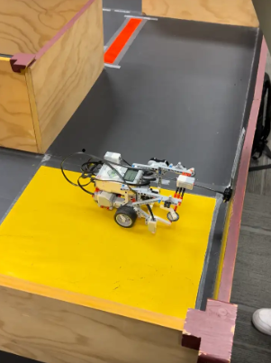
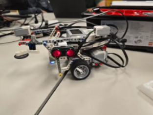
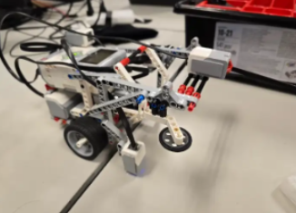
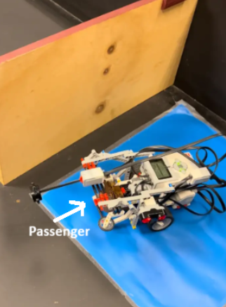
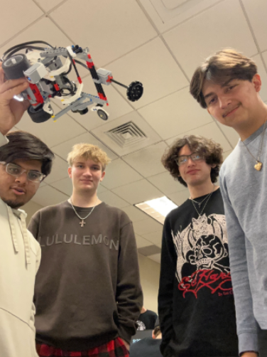

# 🚗 Autonomous Vehicle Navigation System

A small-scale autonomous vehicle prototype designed, built, and programmed to navigate a physical environment, respond to environmental markers and obstacles, and transport a model wheelchair passenger between designated pickup and drop-off locations.

The system was implemented using **MATLAB and LEGO MINDSTORMS EV3**, combining sensor-driven navigation, motor control, autonomous decision-making, and mechanical passenger handling.

**Platform:** LEGO MINDSTORMS EV3  
**Programming Language:** MATLAB  
**Project Type:** Autonomous Vehicle / Robotics Prototype  
**Team Size:** 4

---

## 📸 Project Preview



*Autonomous vehicle prototype navigating the physical course during testing.*

---

## 🎯 Project Overview

This project challenged our four-person engineering team to design, build, program, and test a **small-scale autonomous transportation system**.

Using LEGO MINDSTORMS EV3 as the hardware platform and MATLAB for programming, we developed a vehicle capable of navigating different physical course configurations without direct human control.

The system combined environmental sensing, autonomous navigation logic, motor control, and a mechanical passenger-handling mechanism to complete a transportation mission.

The vehicle needed to:

1. Begin at the designated starting area
2. Autonomously navigate the course
3. Detect obstacles and available paths
4. Respond to designated environmental markers
5. Stop at required stop markers
6. Locate the passenger pickup point
7. Pick up a model wheelchair passenger
8. Transport the passenger through the course
9. Locate the designated drop-off point
10. Safely unload the passenger
11. Complete the course autonomously

The vehicle also needed to remain stable, respond consistently to sensor input, and avoid becoming trapped in repeating navigation patterns.

---

## ⚙️ Vehicle Design

### Left-Side View



### Right-Side View



*Multiple views of the completed autonomous vehicle prototype showing the EV3 controller, sensors, drivetrain, chassis, wiring, and passenger-handling mechanism.*

Our team designed and constructed the vehicle around the **LEGO MINDSTORMS EV3 programmable platform**.

The prototype incorporated:

- LEGO MINDSTORMS EV3 programmable controller
- Electric drive motors
- Color sensor
- Touch sensor
- Distance/proximity sensor
- Custom LEGO chassis
- Mechanical passenger-handling system

The physical design needed to support both autonomous navigation and passenger transportation while maintaining stability during movement and turns.

The hardware platform allowed the team to prototype many of the fundamental concepts involved in autonomous vehicles: **environmental sensing, decision-making, navigation, physical actuation, and transportation.**

---

## 🧠 Autonomous Navigation System

The vehicle used multiple sensor inputs to make navigation decisions as it traveled through the course.

Rather than relying entirely on a predetermined sequence of movements, the system continuously responded to its surrounding environment.

### Navigation Behavior

The primary navigation rules were:

- **Clear path →** Continue forward
- **Front contact/obstacle →** Turn right
- **Opening detected on the left →** Turn left
- **Course marker detected →** Execute the corresponding programmed action

The front-mounted touch sensor provided collision detection, while the left-side distance sensor helped determine when an open path was available.

The color sensor identified mission-specific environmental markers.

### Navigation Decision Loop

```text
                 Read Sensors
                      │
                      ▼
              Check Color Marker
                      │
                      ▼
              Check Environment
               /      |       \
          Front Hit  Left Open  Clear
              │          │        │
          Turn Right   Turn Left  Forward
               \         |        /
                      ▼
                    Repeat
```

This continuous **sense → decide → act** cycle allowed the vehicle to adapt its movement according to its immediate environment.

---

## 🚦 Environmental Markers

Colored areas within the course represented important locations and instructions for the autonomous vehicle.

| Color | Vehicle Response |
| --- | --- |
| 🟨 **Yellow** | Starting / ending area |
| 🟦 **Blue** | Passenger pickup point |
| 🟩 **Green** | Passenger drop-off point |
| 🟥 **Red** | Stop marker |

The vehicle's color sensor allowed the navigation software to distinguish these areas and execute the corresponding mission behavior.

---

## 🗺️ Autonomous Mission

The overall mission combined navigation, environmental recognition, and passenger transportation into a single autonomous sequence.

```text
🟨 START
    │
    ▼
Autonomous Navigation
    │
    ├──── 🟥 STOP MARKER
    │          │
    │      Stop briefly
    │          │
    ▼          ▼
🟦 PASSENGER PICKUP
    │
    ├──── Load Passenger
    │
    ▼
Continue Autonomous Navigation
    │
    ├──── 🟥 STOP MARKER
    │          │
    │      Stop briefly
    │          │
    ▼          ▼
🟩 PASSENGER DROP-OFF
    │
    ├──── Unload Passenger
    │
    ▼
Continue Navigation
    │
    ▼
🟨 FINISH
```

The mission required multiple subsystems to operate together successfully rather than treating navigation, sensing, and passenger handling as isolated tasks.

---

## ♿ Autonomous Passenger Transportation



*Vehicle positioned at the blue passenger pickup area during course testing.*

A major component of the project was demonstrating **autonomous passenger transportation**.

The passenger was represented by a cardboard model of a person using a wheelchair. The vehicle incorporated a mechanical system that allowed it to interact with the passenger at designated locations.

The complete transportation sequence required the vehicle to:

1. Navigate autonomously to the pickup area
2. Recognize the blue pickup marker
3. Activate the passenger-handling mechanism
4. Secure the passenger
5. Continue autonomous navigation
6. Maintain stability while transporting the passenger
7. Recognize the green drop-off marker
8. Release the passenger
9. Continue toward the finishing area

Passenger stability influenced both the mechanical and navigation design. Turns and movement needed to be controlled well enough to prevent the passenger from falling during transportation.

---

## 🔄 Sense → Decide → Act

At the core of the vehicle was a simple autonomous control loop:

```text
┌──────────────────────┐
│    Sense Environment │
│                      │
│ Touch • Distance     │
│ Color                │
└──────────┬───────────┘
           │
           ▼
┌──────────────────────┐
│    Make Decision     │
│                      │
│ Forward • Left       │
│ Right • Stop         │
│ Pickup • Drop-off    │
└──────────┬───────────┘
           │
           ▼
┌──────────────────────┐
│     Take Action      │
│                      │
│ Motors • Movement    │
│ Passenger Mechanism  │
└──────────┬───────────┘
           │
           └──────────────► Repeat
```

Although implemented at a small scale, this demonstrates a fundamental autonomous-systems concept: using environmental input to continuously influence physical behavior.

---

## 🧪 Engineering Requirements

Successful completion required more than simply reaching the end of the course.

The autonomous vehicle needed to:

- Navigate different course configurations
- Operate without direct human control
- Detect physical obstacles
- Detect available paths
- Respond correctly to sensor input
- Recognize designated environmental markers
- Stop at required stop locations
- Locate the passenger pickup point
- Successfully load the passenger
- Transport the passenger through the course
- Locate the designated drop-off point
- Safely unload the passenger
- Avoid repeating navigation loops
- Maintain physical stability
- Complete the transportation mission

These requirements required coordination between the software, sensors, motors, chassis, and passenger-handling mechanism.

---

## 🛠️ Technologies & Engineering Concepts

### Technologies

- **MATLAB**
- **LEGO MINDSTORMS EV3**
- **EV3 Motors**
- **Touch Sensor**
- **Distance Sensor**
- **Color Sensor**

### Engineering Concepts

- Autonomous Systems
- Sensor-Driven Navigation
- Robotics
- Environmental Sensing
- Obstacle Detection
- Motor Control
- Conditional Decision Logic
- Hardware & Software Integration
- Mechanical Design
- Autonomous Transportation
- System Testing
- Iterative Engineering

---

## 👥 Team Collaboration



*Four-person engineering team with the completed autonomous vehicle prototype.*

This project was completed as part of a **four-person engineering team**.

We collaborated across:

- Physical vehicle design
- MATLAB programming
- Sensor integration
- Navigation strategy
- Mechanical passenger handling
- Testing
- Troubleshooting
- Iterative improvements

Successful operation required coordinating the software and mechanical components of the system while repeatedly testing the vehicle against the physical course requirements.

---

## 🧪 Testing & Iteration

The autonomous vehicle was repeatedly tested throughout development to identify failures and improve its behavior.

Testing focused on:

- Sensor response
- Obstacle detection
- Distance detection
- Turning behavior
- Color recognition
- Navigation consistency
- Passenger pickup
- Passenger transportation
- Passenger drop-off
- Vehicle stability
- Navigation-loop prevention
- Overall mission completion

Each test provided feedback that could be used to modify either the physical design or MATLAB control logic.

This iterative process followed a basic engineering cycle:

```text
Design
  │
  ▼
Build
  │
  ▼
Program
  │
  ▼
Test
  │
  ▼
Identify Failure
  │
  ▼
Improve
  │
  └──────────► Test Again
```

---

## 💡 Engineering Takeaways

This project provided hands-on experience combining **software, autonomous systems, sensors, and mechanical design** to solve a physical engineering problem.

Key takeaways included:

- Programming physical hardware using MATLAB
- Integrating multiple sensors into autonomous decision-making
- Translating environmental sensor readings into motor actions
- Developing conditional navigation algorithms
- Designing a continuous sense-decide-act control loop
- Coordinating software with mechanical hardware
- Troubleshooting unpredictable physical-system behavior
- Iteratively improving autonomous navigation
- Designing around vehicle and passenger stability
- Collaborating within an engineering team
- Testing an integrated autonomous system against mission requirements

The project demonstrated how software decisions directly influence physical system behavior and provided an introduction to the engineering principles behind autonomous navigation systems.

---

## 📁 Repository Structure

```text
autonomous-vehicle-navigation-system/
│
├── README.md
│
└── images/
    ├── passenger-pickup.png
    ├── robot-design-left-side.png
    ├── robot-design-right-side.png
    ├── robot-maze.png
    └── team.png
```

---

## 📝 Project Documentation Note

This repository documents the design, functionality, and engineering process of the original autonomous vehicle project.

The vehicle was physically implemented using **LEGO MINDSTORMS EV3 hardware and MATLAB** as a small-scale autonomous navigation prototype.

The original MATLAB source code is no longer available. The navigation logic, system behavior, hardware configuration, and engineering concepts documented here are based on the original project's design and demonstrated functionality rather than a reproduction of the original source code.

---

## 🚗 Project Summary

**Autonomous Vehicle Navigation System** demonstrates a small-scale implementation of autonomous transportation concepts through the integration of:

**Environmental Sensing → Decision Logic → Navigation → Physical Actuation → Passenger Transportation**

Using MATLAB and LEGO MINDSTORMS EV3, the project transformed sensor input into autonomous physical behavior while completing a defined transportation mission without direct human control.
